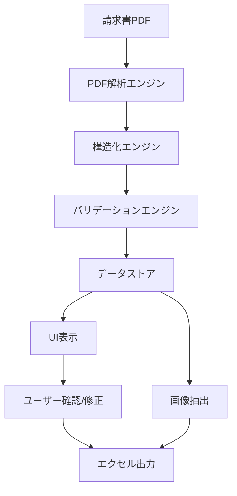
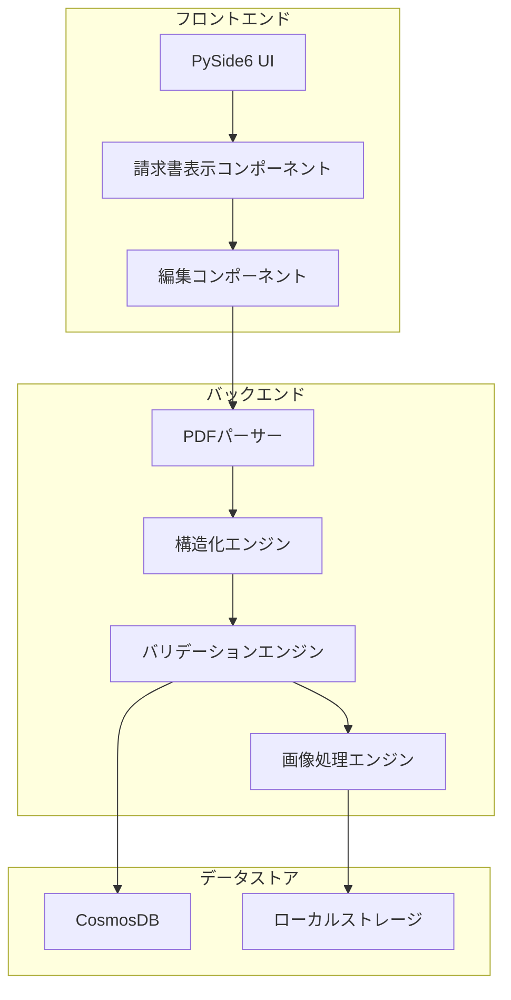
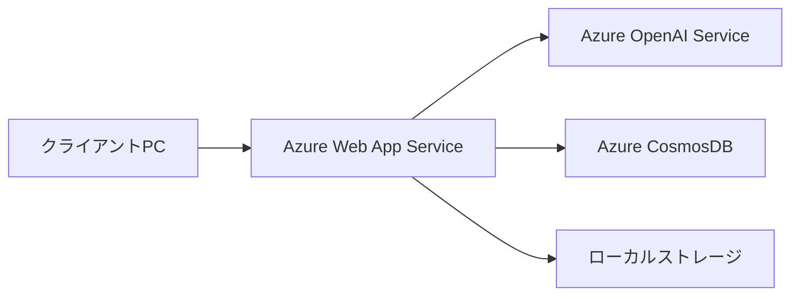
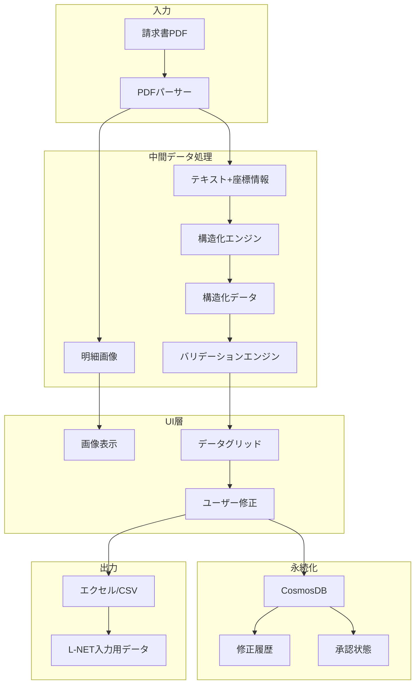
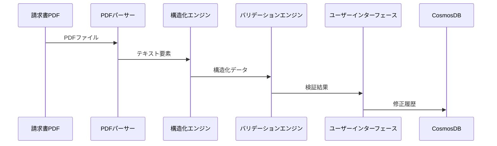
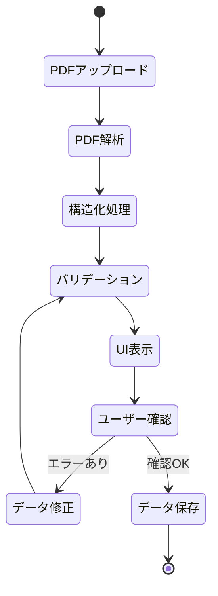
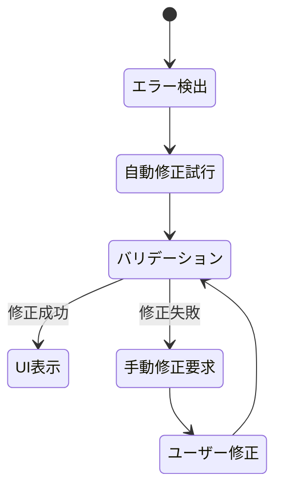

# 請求書構造化システム基本設計書

## 1. システム概要

### 1.1 システムの目的
請求書PDFファイルから必要な情報を自動抽出し、L-NET売上管理システムで利用可能な形式に変換するシステムを開発する。本システムは請求書担当者による確認・修正を前提とした補助システムとして機能し、最終的にL-NET売上管理システムへの入力作業を自動化することを目的とする。

### 1.2 主要機能の概要
1. PDF解析機能：請求書PDFからテキストと位置情報を抽出
2. 構造化機能：抽出したテキストをJSON形式に変換
3. バリデーション機能：抽出データの検証と正規化
4. 画像化機能：請求書明細部分の画像抽出
5. エクセル出力機能：構造化データの出力
6. UI機能：請求書処理の操作・管理画面
7. データベース連携：修正履歴のCosmosDB管理

### 1.3 システムの全体像


## 2. システムアーキテクチャ

### 2.1 全体アーキテクチャ


### 2.2 使用技術スタック
- **フロントエンド**
  - PySide6：デスクトップUIフレームワーク
  - Qt Quick：UIコンポーネント

- **バックエンド**
  - Python 3.10：基本実行環境
  - pdfminer.six：PDF解析
  - Azure OpenAI API：テキスト構造化
  - Pandas：データ操作
  - OpenPyXL：Excel操作
  - Pydantic：データバリデーション

- **データストア**
  - Azure CosmosDB：修正履歴管理
  - ローカルファイルシステム：一時データ保存

### 2.3 インフラストラクチャ構成


### 2.4 データフローアーキテクチャ

#### 2.4.1 データソースと変換フロー

1. 入力データソース
   - 請求書PDF
     - 形式：PDF形式（バージョン1.4以上）
     - 保存場所：ローカルファイルシステム
     - 用途：テキスト抽出、画像抽出の入力

2. 中間データ構造
   a. PDFパース結果
      - 形式：Dict[int, List[TextElement]]
      - 内容：ページ毎のテキスト要素と座標情報
      - 保存：メモリ上（一時的）
      - 用途：構造化エンジンの入力

   b. 構造化データ（JSON）
      - 形式：DocumentStructure（Pydanticモデル）
      - 内容：階層化された請求書情報
      - 保存：メモリ上（一時的）
      - 用途：バリデーション、UI表示の入力

   c. 明細画像データ
      - 形式：JPEG（解像度360dpi）
      - 保存場所：ローカルファイルシステム
      - 命名規則：「PDFファイル名－明細番号.jpg」
      - 用途：UI表示、データ確認

3. 永続化データ
   a. CosmosDB
      - コンテナ：modifications
      - 主要データ：
        * 修正履歴（ModificationHistory）
        * 承認状態
        * ユーザー操作ログ
      - インデックス：invoice_id, modified_at
      - 用途：監査証跡、状態管理

4. 出力データ
   a. エクセル/CSV
      - 形式：XLSX/CSV（UTF-8 BOM付き）
      - 内容：フラット化された請求書データ
      - カラム順：document → customer → entry → stock → quantity
      - 用途：L-NET売上管理システムへの入力

#### 2.4.2 データ変換フロー図


#### 2.4.3 データ変換マッピング

1. PDF → 構造化データ
```typescript
// 入力: PDFテキスト要素
type TextElement = {
    text: string;
    x0: number;
    y0: number;
    x1: number;
    y1: number;
    page: number;
}

// 出力: 構造化データ
interface DocumentStructure {
    pdf_filename: string;
    total_amount: string;
    customers: CustomerEntry[];
}
```

2. 構造化データ → UI表示データ
```typescript
// UI表示用データ構造
interface UIDisplayData {
    details: {
        id: string;
        no: string;
        description: string;
        amount: string;
        status: 'pending' | 'approved' | 'error';
        imageUrl: string;
    }[];
    validation: {
        errors: ValidationError[];
        warnings: ValidationWarning[];
    };
}
```

3. UI修正データ → 永続化データ
```typescript
// 修正履歴データ構造
interface ModificationHistory {
    invoice_id: string;
    modified_at: string;
    modified_fields: {
        field: string;
        old_value: string;
        new_value: string;
        reason: string;
    }[];
    page_no: number;
    user_id: string;
}
```

4. 構造化データ → エクセル/CSV
```typescript
// エクセル/CSV出力カラム定義
interface ExportColumns {
    // ドキュメント情報
    pdf_filename: string;
    total_amount: string;
    
    // 顧客情報
    customer_code: string;
    customer_name: string;
    department: string;
    box_number: string;
    
    // 明細情報
    no: string;
    description: string;
    tax_rate: string;
    amount: string;
    date_range: string;
    page_no: number;
    
    // 在庫情報
    stock_carryover: number;
    stock_incoming: number;
    stock_w_value: number;
    // ... 他の在庫関連フィールド
    
    // 数量情報
    quantity_quantity: number;
    quantity_unit_price: number;
}
```

## 3. モジュール設計

### 3.1 データモデル

#### 3.1.1 データモデルの基本概念
請求書データは階層構造で管理され、以下の関係性を持ちます：
- DocumentStructure: 請求書全体を表現する最上位構造
- CustomerEntry: 取引先情報と明細のグループ
- EntryDetail: 個々の請求明細項目
- StockInfo/QuantityInfo: 明細に関連する在庫・数量情報

この階層構造により、以下の利点が得られます：
- 請求書全体の一貫性の確保
- 顧客単位での明細管理の実現
- 明細情報の柔軟な拡張性

#### 3.1.2 データ検証と整合性
各クラスはPydanticのBaseModelを継承し、以下の機能を提供：
- 型安全性の確保
- 必須項目の検証
- データ変換の自動化

#### 3.1.3 実装コード
```python
class StockInfo(BaseModel):
    carryover: int
    incoming: int
    w_value: int
    outgoing: int
    remaining: int
    total: int
    unit_price: int

class QuantityInfo(BaseModel):
    quantity: int
    unit_price: Optional[int] = None

class EntryDetail(BaseModel):
    no: str
    description: str
    tax_rate: str
    amount: str
    stock_info: Optional[StockInfo] = None
    quantity_info: Optional[QuantityInfo] = None
    date_range: Optional[str] = None
    page_no: int

class CustomerEntry(BaseModel):
    customer_code: str
    customer_name: str
    department: str
    box_number: str
    entries: List[EntryDetail]

class DocumentStructure(BaseModel):
    pdf_filename: str
    total_amount: str
    customers: List[CustomerEntry]
```

### 3.2 PDFパーサーモジュール

#### 3.2.1 PDFパース処理の基本方針
PDFパーサーは以下の方針でテキスト抽出を行います：
1. ページ単位での処理
   - 各ページを独立して解析
   - ページ間の関連性を維持
2. 座標情報の取得
   - 文字単位での位置情報抽出
   - レイアウト構造の解析
3. エラー処理
   - PDFバージョンの互換性確認
   - 文字化けの検出と対応

#### 3.2.2 座標情報の活用方針
抽出された座標情報は以下の目的で使用：
- 明細行の位置特定
- 関連情報のグループ化
- レイアウトベースの構造化支援

#### 3.2.3 実装コード
```python
class PDFParser:
    def __init__(self, pdf_path: str):
        self.pdf_path = pdf_path
        self.pages = []

    def extract_text_with_positions(self) -> Dict[int, List[TextElement]]:
        """ページ毎のテキスト要素と位置情報を抽出"""
        # pdfminer.sixを使用してPDFからテキストと座標を抽出
        pass

    def validate_pdf_version(self) -> bool:
        """PDFバージョンの検証（1.4以上を推奨）"""
        pass

    def get_page_dimensions(self) -> List[Tuple[float, float]]:
        """各ページの寸法を取得"""
        pass
```

### 3.3 構造化エンジンモジュール

#### 3.3.1 構造化処理の基本方針
Azure OpenAI APIを利用した構造化処理の基本方針：
1. コンテキスト管理
   - 請求書形式の特徴を考慮
   - 複数ページにまたがる情報の連携
2. プロンプト設計
   - 明確な指示と制約の提供
   - エッジケースへの対応
3. 出力形式の標準化
   - JSON形式での一貫した出力
   - 型安全性の確保

#### 3.3.2 Few-shot学習の活用
学習効率を高めるための戦略：
- 代表的なパターンの例示
- エラーケースの学習
- 継続的な精度向上

#### 3.3.3 実装コード
```python
class StructuringEngine:
    def __init__(self, openai_client: AzureOpenAI):
        self.client = openai_client
        self.prompt_engine = PromptEngineering()

    async def structure_invoice(self, text_elements: Dict[int, List[TextElement]]) -> DocumentStructure:
        """請求書テキストの構造化処理"""
        system_prompt = """
        請求書のテキストから顧客情報と明細を抽出し、構造化データとして出力してください。
        以下の重要な処理ルールに従ってください：

        1. 改ページ処理の考慮：
           - 各ページにはヘッダー情報が含まれる可能性がある
           - ページをまたぐ顧客情報は、同じ顧客コードで関連付け

        2. 顧客情報の継続性：
           - 顧客コードが出現した後、次の顧客コードまでの明細は同じ顧客に属する
           - 改ページ後も顧客情報の連続性を維持

        3. 明細の抽出ルール：
           - 明細番号の連続性を保持
           - 基本情報と追加情報を漏れなく抽出
           - 各明細にページ番号を付与
        """
        pass

    def validate_structure(self, invoice_data: DocumentStructure) -> ValidationResult:
        """構造化データの検証"""
        pass
```

### 3.4 バリデーションモジュール

#### 3.4.1 バリデーション体系
検証は以下の階層で実施されます：
1. 基本検証
   - データ型の確認
   - 必須項目の存在確認
   - フォーマットの検証
2. ビジネスルール検証
   - 金額計算の整合性
   - 日付の妥当性
   - 項目間の関連性
3. カスタム検証
   - 業務固有のルール
   - 特殊なフォーマット要件

#### 3.4.2 自動修正の方針
エラー検出時の対応フロー：
1. エラーの重要度判定
2. 自動修正の可否判断
3. 修正履歴の記録
4. ユーザー確認の要否判定

#### 3.4.3 実装コード
```python
class ValidationEngine:
    def __init__(self, rules: List[ValidationRule]):
        self.rules = rules
        self.validators = self._initialize_validators()

    def validate_invoice(self, invoice_data: DocumentStructure) -> ValidationResult:
        """請求書データの検証実行"""
        validations = [
            self._validate_amounts,
            self._validate_dates,
            self._validate_required_fields,
            self._validate_relationships
        ]
        return self._run_validations(invoice_data, validations)

    def normalize_data(self, invoice_data: DocumentStructure) -> DocumentStructure:
        """データの正規化処理"""
        normalizers = [
            self._normalize_amounts,
            self._normalize_dates,
            self._normalize_tax_rates
        ]
        return self._apply_normalizers(invoice_data, normalizers)
```

### 3.5 画像処理モジュール

#### 3.5.1 明細行抽出の基本方針
明細行の特定と抽出の手順：
1. 明細番号の検出
   - 正規表現によるパターンマッチ
   - 座標位置の特定
2. 明細範囲の決定
   - 上下のマージン設定
   - 隣接明細との境界処理
3. 画像切り出し
   - 解像度の最適化（200dpi）
   - 品質パラメータの調整

#### 3.5.2 座標変換システム
PDF座標から画像座標への変換プロセス：
1. 座標系の統一
   - PDFポイント座標からピクセル座標への変換
   - スケール係数の計算
2. 座標の正規化
   - A4サイズを基準とした座標変換
   - マージン領域の考慮

#### 3.5.3 実装コード
```python
@dataclass
class DetailLine:
    """明細行の情報を保持するクラス"""
    page_num: int
    no: str
    y_top: float
    y_bottom: float
    description: str = ""
    x_left: float = 40
    x_right: float = 800

class ImageProcessor:
    def __init__(self, dpi: int = 200):
        self.dpi = dpi
        self.pdf_height = 842  # A4サイズの高さ（ポイント単位）

    def extract_detail_regions(self, pdf_path: str) -> List[DetailLine]:
        """PDFから明細行の位置情報を抽出する"""
        detail_lines = []
        current_page = 0

        for page_layout in extract_pages(pdf_path):
            # 明細番号とその位置を収集
            number_positions = self._collect_detail_numbers(page_layout)
            
            # 各明細行の範囲を決定
            page_details = self._determine_detail_regions(
                number_positions, 
                page_layout.height, 
                current_page
            )
            detail_lines.extend(page_details)
            current_page += 1

        return detail_lines

    def process_details(self, pdf_path: str, detail_lines: List[DetailLine], 
                       output_dir: str, debug_dir: str = None):
        """明細行の処理とデバッグ画像の作成"""
        os.makedirs(output_dir, exist_ok=True)
        if debug_dir:
            os.makedirs(debug_dir, exist_ok=True)

        # PDFの各ページを画像に変換
        pages = convert_from_path(pdf_path, dpi=self.dpi)
        
        for page_num, page_image in enumerate(pages):
            # このページの明細を抽出
            page_details = [d for d in detail_lines if d.page_num == page_num]
            if not page_details:
                continue

            # スケール係数を計算
            scale_factor = page_image.height / self.pdf_height
            
            # 明細行の切り出しと保存
            self._process_page_details(
                page_image, 
                page_details, 
                scale_factor, 
                output_dir, 
                page_num,
                debug_dir
            )

    def _collect_detail_numbers(self, page_layout: LTPage) -> List[tuple]:
        """ページ内の明細番号とその位置を収集"""
        number_positions = []
        for element in page_layout:
            if isinstance(element, LTTextContainer):
                text = element.get_text().strip()
                detail_no = self._is_detail_number(text)
                if detail_no:
                    number_positions.append((detail_no, element.y1, element.y0))
        return sorted(number_positions, key=lambda x: -x[1])

    def _is_detail_number(self, text: str) -> Optional[str]:
        """明細番号かどうかを判定する"""
        patterns = [
            r'^No.\s*(\d+)\s*$',  # No.10 or No10
            r'^\s*(\d+)\s*$'      # 10
        ]
        for pattern in patterns:
            match = re.match(pattern, text, re.IGNORECASE)
            if match:
                return match.group(1)
        return None

    def _process_page_details(self, page_image: Image, details: List[DetailLine],
                            scale_factor: float, output_dir: str, page_num: int,
                            debug_dir: str = None):
        """ページ内の明細行を処理"""
        if debug_dir:
            debug_image = page_image.copy()
            debug_draw = ImageDraw.Draw(debug_image)

        for detail in details:
            # 座標変換
            coords = self._convert_coordinates(detail, scale_factor)
            
            # 明細行の切り出しと保存
            cropped_image = page_image.crop(coords)
            output_path = os.path.join(
                output_dir, 
                f'page{page_num + 1}_detail{detail.no}.jpg'
            )
            cropped_image.save(output_path, 'JPEG', quality=95)

            # デバッグ画像の作成（オプション）
            if debug_dir:
                self._draw_debug_info(debug_draw, coords, detail)

        # デバッグ画像の保存
        if debug_dir:
            debug_path = os.path.join(debug_dir, f'debug_page_{page_num + 1}.jpg')
            debug_image.save(debug_path, 'JPEG', quality=95)
```

### 3.6 UIモジュール

#### 3.6.1 UI設計の基本方針
ユーザビリティを重視した設計原則：
1. 情報の階層化
   - 重要度に基づく表示優先順位
   - 関連情報のグループ化
2. 視覚的フィードバック
   - 処理状態の明示
   - エラー箇所の強調表示
3. 操作効率の最適化
   - キーボードショートカット
   - 一括処理機能

#### 3.6.2 画面構成の考え方
1. 明細一覧パネル
   - 効率的なナビゲーション
   - 状態の視覚化
2. 詳細表示パネル
   - クロップ画像とデータの同時表示
   - インラインでの編集機能
3. 操作フィードバック
   - 処理状況のリアルタイム表示
   - エラー情報の即時フィードバック

#### 3.6.3 実装コード
```python
class MainWindow(QMainWindow):
    def __init__(self):
        super().__init__()
        self.init_ui()

    def init_ui(self):
        """UI初期化"""
        self.upload_widget = UploadWidget()
        self.monitor_widget = MonitorWidget()
        self.edit_widget = EditWidget()
        self.approval_widget = ApprovalWidget()
        self.setup_layout()

class UploadWidget(QWidget):
    def __init__(self, parent=None):
        """請求書PDFアップロードウィジェット"""
        super().__init__(parent)
        self.setup_drag_drop()
        self.setup_progress_bar()

class MonitorWidget(QWidget):
    def __init__(self, parent=None):
        """処理状況モニタリングウィジェット"""
        super().__init__(parent)
        self.setup_status_view()
        self.setup_error_display()

class EditWidget(QWidget):
    def __init__(self, parent=None):
        """請求書編集ウィジェット"""
        super().__init__(parent)
        self.setup_pdf_viewer()
        self.setup_data_editor()
        self.setup_validation_display()
```

### 3.7 データベースモジュール

#### 3.7.1 データ永続化の基本方針
CosmosDBを使用したデータ管理戦略：
1. データ分類
   - トランザクションデータ（修正履歴）
   - 参照データ（承認状態）
   - 監査データ（操作ログ）
2. 整合性の確保
   - 楽観的ロック
   - バージョン管理
3. パフォーマンス最適化
   - インデックス設計
   - パーティション戦略

#### 3.7.2 修正履歴管理の考え方
変更追跡の目的と実装：
1. 監査証跡の確保
   - 変更内容の記録
   - 変更理由の管理
2. ロールバック対応
   - 変更の取り消し
   - 状態の復元
3. 分析・改善
   - エラーパターンの分析
   - システム改善への活用

#### 3.7.3 実装コード
```python
class CosmosDBManager:
    def __init__(self, connection_string: str):
        self.client = CosmosClient.from_connection_string(connection_string)
        self.database = self.client.get_database_client("invoices")
        self.container = self.database.get_container_client("modifications")

    async def save_modification_history(self, history: ModificationHistory) -> bool:
        """修正履歴の保存"""
        try:
            await self.container.create_item(body=history.dict())
            return True
        except Exception as e:
            logger.error(f"Failed to save modification history: {e}")
            return False

    async def get_modification_history(self, invoice_id: str) -> List[ModificationHistory]:
        """修正履歴の取得"""
        query = f"SELECT * FROM c WHERE c.invoice_id = '{invoice_id}' ORDER BY c.modified_at DESC"
        return [ModificationHistory(**item) for item in self.container.query_items(query)]
```

## 4. データフロー設計

### 4.1 データの流れ


### 4.2 データ構造定義
```typescript
interface ModificationHistory {
    invoice_id: string;
    modified_at: string;
    modified_fields: Array<{
        field: string;
        old_value: string;
        new_value: string;
        reason: string;
    }>;
    page_no: number;
    user_id: string;
}

interface ValidationResult {
    is_valid: boolean;
    errors: Array<{
        field: string;
        message: string;
        severity: 'error' | 'warning';
    }>;
    normalized_data?: DocumentStructure;
}
```

## 5. 処理フロー設計

### 5.1 メインフロー


### 5.2 エラーフロー


### 5.3 並列処理フロー
```python
class ParallelProcessor:
    def __init__(self, folder_path: str):
        self.folder_path = folder_path
        self.pdf_files = self._get_pdf_files()
        
    def _get_pdf_files(self) -> List[str]:
        """指定フォルダから全PDFファイルのパスを取得"""
        return glob.glob(f"{self.folder_path}/*.pdf")
    
    async def process_pdfs(self):
        """PDFファイルの並列処理を実行"""
        tasks = [self.process_single_pdf(pdf) for pdf in self.pdf_files]
        return await asyncio.gather(*tasks)

    async def process_single_pdf(self, pdf_path: str):
        """単一PDFの処理"""
        try:
            parser = PDFParser(pdf_path)
            text_elements = await parser.extract_text_with_positions()
            
            structurer = StructuringEngine(self.openai_client)
            invoice_data = await structurer.structure_invoice(text_elements)
            
            validator = ValidationEngine(self.validation_rules)
            validation_result = await validator.validate_invoice(invoice_data)
            
            return {
                'pdf_path': pdf_path,
                'invoice_data': invoice_data,
                'validation_result': validation_result
            }
        except Exception as e:
            logger.error(f"Error processing {pdf_path}: {e}")
            return {
                'pdf_path': pdf_path,
                'error': str(e)
            }
```

## 6. エラーハンドリング設計

### 6.1 エラーの種類と対応
| エラー種別 | 対応方法 | 重要度 |
|------------|----------|---------|
| PDFバージョン不適合 | ユーザーに通知し、推奨バージョンを案内 | 高 |
| 文字化け | 文字コード変換を試行、失敗時は手動確認 | 中 |
| 必須項目未検出 | UI上で該当項目を強調表示し、手動入力を要求 | 高 |
| 金額不整合 | 自動再計算を試行、差異を表示して確認を要求 | 高 |

### 6.2 ログ設計
```python
class LogManager:
    def __init__(self):
        self.logger = self._setup_logger()

    def log_error(self, error_type: str, details: Dict):
        """エラーログの記録"""
        self.logger.error(f"Error type: {error_type}", extra=details)

    def log_validation(self, result: ValidationResult):
        """検証結果のログ記録"""
        self.logger.info("Validation result", extra=result.dict())

    def log_modification(self, history: ModificationHistory):
        """修正履歴のログ記録"""
        self.logger.info("Modification history", extra=history.dict())
```

### 6.3 監視設計
- エラー発生率の監視
- 処理時間の計測
- リソース使用状況の監視
- ユーザー操作の追跡

## 7. セキュリティ設計

### 7.1 アクセス制御
- ユーザー名とパスワードによる基本認証
- アクセス権限の管理（管理者/一般ユーザー）
- CosmosDBへのアクセス制御
- 監査ログの記録

### 7.2 データ保護
- 請求書データの暗号化保存
- 一時ファイルの自動削除
- バックアップ戦略

### 7.3 通信セキュリティ
- Azure OpenAI APIとの通信暗号化
- CosmosDBとの通信暗号化
- ローカルファイルアクセスの制限

## 8. 非機能要件設計

### 8.1 パフォーマンス設計
- 目標処理時間：1請求書あたり30秒以内
- 並列処理による効率化
- メモリ使用量の最適化

### 8.2 スケーラビリティ設計
- 処理量に応じた並列度の調整
- リソース使用量の動的制御
- データベース接続プールの管理

### 8.3 可用性設計
- エラー時の自動リトライ
- 処理の中断・再開機能
- バックアップ・リストア手順

### 8.4 保守性設計
- モジュール化による機能分離
- 設定ファイルによる動作制御
- 詳細なログ記録

## 9. 開発スケジュール

### 9.1 フェーズ1（1次開発）
1. PDF解析機能の実装（2週間）
   - pdfminer.sixの導入と設定
   - テキスト抽出処理の実装
   - 座標情報の取得処理の実装

2. 構造化機能の実装（2週間）
   - Azure OpenAI APIの設定
   - プロンプトエンジニアリングの実装
   - Few-shot学習の実装

3. バリデーション機能の実装（2週間）
   - バリデーションルールの実装
   - 自動修正ロジックの実装
   - エラーハンドリングの実装

4. 画像処理機能の実装（1週間）
   - 画像抽出処理の実装
   - 画質調整機能の実装
   - 保存処理の実装

5. エクセル出力機能の実装（1週間）
   - データ変換処理の実装
     - ドキュメント情報（pdf_filename, total_amount）
     - 顧客情報（customer_code, customer_name, department, box_number）
     - 明細情報（no, description, tax_rate, amount, date_range, page_no）
     - 在庫情報（carryover, incoming, w_value, outgoing, remaining, total, unit_price）
     - 数量情報（quantity, unit_price）
   - Excel形式での出力処理
     - カテゴリ別の列順序定義
     - データのフラット化処理
     - CSV形式での出力
   - メタデータ付与の実装

6. UI基本機能の実装（2週間）
   - 各画面のレイアウト実装
   - イベントハンドリングの実装
   - エラー表示機能の実装

7. テスト・デバッグ（2週間）
   - 単体テストの実施
   - 結合テストの実施
   - パフォーマンステストの実施

### 9.2 フェーズ2（2次開発）
1. L-NET連携機能の設計（2週間）
2. RPA実装（3週間）
3. 統合テスト（2週間）

### 9.3 リスク管理
| リスク | 影響度 | 対策 |
|--------|--------|------|
| PDF解析精度の不足 | 高 | 事前検証の実施、代替手段の確保 |
| API利用コストの増大 | 中 | 使用量の監視、最適化の実施 |
| 処理速度の低下 | 中 | パフォーマンスチューニング、並列処理の活用 |
| データ整合性の崩れ | 高 | 厳密なバリデーション、バックアップの確保 |

## 10. 詳細UI設計

### 10.0 画面概要仕様

#### 10.0.1 基本要件
- 対応OS：Windows 10以上
- 画面解像度：1280×720以上（デスクトップ専用）
- 表示言語：日本語
- 実行環境：Python 3.10以上、PySide6

#### 10.0.2 主要機能
1. インラインエディティング機能
   - 構造化データグリッド内での直接編集
   - ダブルクリックで編集モード開始
   - Tab/Enterキーで次のセルに移動
   - ESCキーで編集キャンセル
   - 編集内容のリアルタイムバリデーション

2. 検索機能
   - 左パネルでの明細行検索
   - 顧客名と商品名での部分一致検索
   - リアルタイムフィルタリング
   - 検索結果のハイライト表示

#### 10.0.3 バリデーションワークフロー
1. 明細行の表示と選択
   - サイドパネルからの明細選択
   - キーボードショートカットによる移動
   - 複数明細の一括選択

2. データ確認プロセス
   - クロップ画像の確認
   - 構造化データの検証
   - フィールド状態の確認

3. 修正・承認フロー
   - エラー項目の修正
   - 修正履歴の記録
   - 明細行の承認
   - 一括承認処理

4. 完了処理
   - 全明細の承認確認
   - データの最終検証
   - 確定処理の実行

#### 10.0.4 画面遷移フロー
```
[PDFアップロード] → [明細一覧表示] → [明細確認・修正] → [承認] → [確定]
```

### 10.1 画面レイアウト構成

#### 10.1.1 画面レイアウト概要
```
+--------------------+--------------------------------+
|  [検索]           |  [ショートカット表示]          |
|  🔍 ____________  |  Alt+↑↓: 移動                  |
+--------------------+  Space: 選択  Enter: 承認      |
|  [フィルター]      |                               |
|  ○ すべて         |                               |
|  ○ 未確認のみ     |                               |
+--------------------+--------------------------------+
|  明細行一覧        |  [明細行状態バー]              |
|  [幅: 250px]      |                                |
|                    |  [クロップ画像]               |
|  [✓] No.1  ✓      |    + - □                      |
|      製品A         |                                |
|      100×¥1,000   |  [構造化データグリッド]        |
|                    |  +----------+----------+----------+----------+
|  [ ] No.2  ⚠      |  |明細番号: |No.1     |商品名:   |製品A    |
|      製品B         |  +----------+----------+----------+----------+
|      200×¥2,000   |  |数量:     |100      |単価:     |¥1,000   |
|                    |  +----------+----------+----------+----------+
+--------------------+  |税率:     |10%      |金額:     |¥100,000 |
|  選択: 2/10件      |  +----------+----------+----------+----------+
|  [一括承認]        |  |在庫情報:                                 |
+--------------------+  |  繰越: 100  入庫: 50  出庫: 30  残高: 120|
                       +------------------------------------------+
```

#### 10.1.2 Qt実装コード
```python
class MainWindow(QMainWindow):
    def __init__(self):
        super().__init__()
        
        # メインウィジェット
        main_widget = QWidget()
        self.setCentralWidget(main_widget)
        
        # メインレイアウト（水平分割）
        main_layout = QHBoxLayout(main_widget)
        
        # 左パネル（明細一覧）
        left_panel = QWidget()
        left_layout = QVBoxLayout(left_panel)
        
        # フィルター部分
        filter_group = QGroupBox("フィルター")
        filter_layout = QVBoxLayout(filter_group)
        all_radio = QRadioButton("すべて")
        unconfirmed_radio = QRadioButton("未確認のみ")
        filter_layout.addWidget(all_radio)
        filter_layout.addWidget(unconfirmed_radio)
        
        # 明細一覧（QListWidget）
        detail_list = QListWidget()
        detail_list.setFixedWidth(250)
        
        # 一括承認部分
        bulk_approve = QPushButton("一括承認")
        selection_label = QLabel("選択: 0/0件")
        
        left_layout.addWidget(filter_group)
        left_layout.addWidget(detail_list)
        left_layout.addWidget(selection_label)
        left_layout.addWidget(bulk_approve)
        
        # 右パネル（詳細表示）
        right_panel = QWidget()
        right_layout = QVBoxLayout(right_panel)
        
        # ショートカット表示
        shortcut_label = QLabel("Alt+↑↓: 移動  Space: 選択  Enter: 承認")
        
        # 明細行状態バー
        status_bar = QStatusBar()
        
        # クロップ画像表示
        image_view = QGraphicsView()
        toolbar = QToolBar()
        toolbar.addAction(QIcon(), "拡大")
        toolbar.addAction(QIcon(), "縮小")
        toolbar.addAction(QIcon(), "実寸")
        
        # 構造化データ表示
        data_table = QTableWidget()
        
        right_layout.addWidget(shortcut_label)
        right_layout.addWidget(status_bar)
        right_layout.addWidget(toolbar)
        right_layout.addWidget(image_view)
        right_layout.addWidget(data_table)
        
        # メインレイアウトに追加
        main_layout.addWidget(left_panel)
        main_layout.addWidget(right_panel)
```

### 10.2 コンポーネント仕様

#### 10.2.1 サイドパネル明細行表示（QListWidget）
- カスタムデリゲートによる2行表示
  - 1行目：明細番号 + 商品名 + 状態アイコン
  - 2行目：数量×単価
- 状態アイコン表示（QIcon）
  - ✓ 承認済（QColor(76, 175, 80)）
  - ⚠ エラーあり（QColor(244, 67, 54)）
  - ⟳ 確認中（QColor(33, 150, 243)）
  - － 未確認（QColor(158, 158, 158)）

#### 10.2.2 構造化データ表示（QTableWidget）
- インラインエディティング機能
  - QTableWidgetItemのフラグ設定（ItemIsEditable）
  - カスタムデリゲートによる編集制御
  - 入力バリデーション（数値制限、文字数制限）
  - 編集状態の視覚的フィードバック
- フィールド状態の視覚的表現（QColor）
  - 未修正：白背景（Qt::white）
  - ユーザー修正済：薄い青背景（QColor(227, 242, 253)）
  - システム自動修正：薄い緑背景（QColor(232, 245, 233)）
  - 要確認：薄い黄背景（QColor(255, 248, 225)）
  - エラー：薄い赤背景（QColor(255, 235, 238)）

#### 10.2.3 クロップ画像表示（QGraphicsView）
- 画像操作機能
  - 拡大/縮小（QGraphicsView::scale）
  - 実寸表示（QGraphicsView::resetTransform）
  - プリロード（QPixmapCache使用、前後2件）

### 10.3 キーボードショートカット

#### 10.3.1 明細行操作
- Alt + ↑: 前の明細行
- Alt + ↓: 次の明細行
- Alt + Shift + ↑: 前のエラー/未確認明細行
- Alt + Shift + ↓: 次のエラー/未確認明細行

#### 10.3.2 選択操作
- Space: 現在の明細行を選択/解除
- Alt + A: すべて選択
- Alt + D: 選択解除

#### 10.3.3 承認操作
- Enter: 現在の明細行を承認
- Alt + Enter: 選択中の明細行を一括承認

#### 10.3.4 画像操作
- Ctrl + '+': 拡大
- Ctrl + '-': 縮小
- Ctrl + '0': 実寸表示

### 10.4 データ連動仕様

#### 10.4.1 検索機能
```python
class SearchableListWidget(QListWidget):
    def __init__(self):
        super().__init__()
        self._setup_search()

    def _setup_search(self):
        """検索機能のセットアップ"""
        # 検索バー
        self.search_bar = QLineEdit()
        self.search_bar.setPlaceholderText("顧客名/商品名で検索...")
        self.search_bar.textChanged.connect(self._on_search_text_changed)

        # 検索インデックス
        self._search_index = {
            'customer': defaultdict(list),  # 顧客名 → 明細行
            'product': defaultdict(list)    # 商品名 → 明細行
        }

    def _on_search_text_changed(self, text: str):
        """検索テキスト変更時の処理"""
        if not text:
            self._reset_filter()
            return

        # 検索実行
        matches = self._search_items(text.lower())
        self._apply_filter(matches)
        self._highlight_matches(matches)

    def _search_items(self, query: str) -> Set[QListWidgetItem]:
        """検索実行"""
        matches = set()
        for field in ['customer', 'product']:
            for key, items in self._search_index[field].items():
                if query in key.lower():
                    matches.update(items)
        return matches
```

#### 10.4.2 インラインエディティング
```python
class EditableTableWidget(QTableWidget):
    # 編集完了シグナル
    edit_completed = Signal(str, str, str)  # field_name, old_value, new_value
    
    def __init__(self):
        super().__init__()
        self._setup_editing()

    def _setup_editing(self):
        """編集機能のセットアップ"""
        # 編集モード設定
        self.setEditTriggers(QAbstractItemView.DoubleClicked)
        
        # バリデータ設定
        self._setup_validators()
        
        # 編集完了イベント接続
        self.itemChanged.connect(self._on_item_edited)

    def _setup_validators(self):
        """フィールド別バリデータ設定"""
        self.validators = {
            'quantity': QIntValidator(0, 999999),
            'unit_price': QDoubleValidator(0, 999999999.99, 2),
            'amount': QDoubleValidator(0, 999999999.99, 2)
        }

    def _on_item_edited(self, item: QTableWidgetItem):
        """編集完了時の処理"""
        if not self._validate_edit(item):
            return

        field_name = self.horizontalHeaderItem(item.column()).text()
        old_value = item.data(Qt.UserRole)
        new_value = item.text()

        # 編集完了シグナル発行
        self.edit_completed.emit(field_name, old_value, new_value)
```

#### 10.4.3 明細行選択時の動作

#### 10.4.1 明細行選択時の動作
1. 明細行選択
2. クロップ画像の即時切り替え
3. 構造化データの更新
4. 状態表示の更新

#### 10.4.2 プリロード仕様
- 対象：前後2件の明細行
- プリロードデータ
  - クロップ画像
  - 構造化データ
  - 状態情報

#### 10.4.3 一括承認機能
- 複数明細行の選択
- 選択明細行の一括承認
- 承認後の選択状態クリア

#### 10.4.4 Qt実装コード
```python
class MainWindow(QMainWindow):
    # カスタムシグナル
    detail_selected = Signal(str)  # 明細番号
    detail_approved = Signal(str)  # 明細番号
    details_bulk_approved = Signal(list)  # 明細番号リスト
    
    def __init__(self):
        super().__init__()
        self._setup_signals()
    
    def _setup_signals(self):
        """シグナル・スロット接続"""
        # 明細選択
        self.detail_list.itemSelectionChanged.connect(self._on_detail_selected)
        self.detail_list.itemDoubleClicked.connect(self._on_detail_double_clicked)
        
        # 承認操作
        self.approve_button.clicked.connect(self._on_detail_approved)
        self.bulk_approve_button.clicked.connect(self._on_bulk_approved)
        
        # キーボードショートカット
        QShortcut(QKeySequence("Alt+Up"), self, self._select_previous_detail)
        QShortcut(QKeySequence("Alt+Down"), self, self._select_next_detail)
        QShortcut(QKeySequence("Return"), self, self._on_detail_approved)

    def _on_detail_selected(self):
        """明細選択時の処理"""
        current_item = self.detail_list.currentItem()
        if not current_item:
            return
            
        detail_no = current_item.data(Qt.UserRole)
        
        # クロップ画像更新
        self._update_detail_image(detail_no)
        
        # 構造化データ更新
        self._update_detail_data(detail_no)
        
        # 状態表示更新
        self._update_status(detail_no)
        
        # プリロード実行
        self._preload_adjacent_details(detail_no)
    
    def _preload_adjacent_details(self, current_no: str):
        """前後2件のプリロード"""
        adjacent_nos = self._get_adjacent_detail_nos(current_no, 2)
        for no in adjacent_nos:
            # 画像のプリロード
            image = self._load_detail_image(no)
            QPixmapCache.insert(f"detail_{no}", image)
            
            # データのプリロード
            self._cache_detail_data(no)

    def _on_bulk_approved(self):
        """一括承認処理"""
        selected_items = self.detail_list.selectedItems()
        if not selected_items:
            return
            
        detail_nos = [
            item.data(Qt.UserRole)
            for item in selected_items
        ]
        
        # 一括承認実行
        self.details_bulk_approved.emit(detail_nos)
        
        # 選択状態クリア
        self.detail_list.clearSelection()
        
        # UI更新
        self._update_selection_count()
        self._refresh_detail_list()
```
