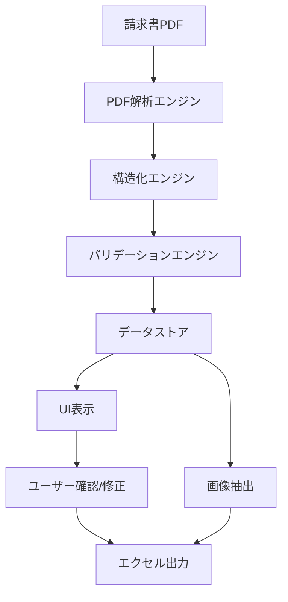
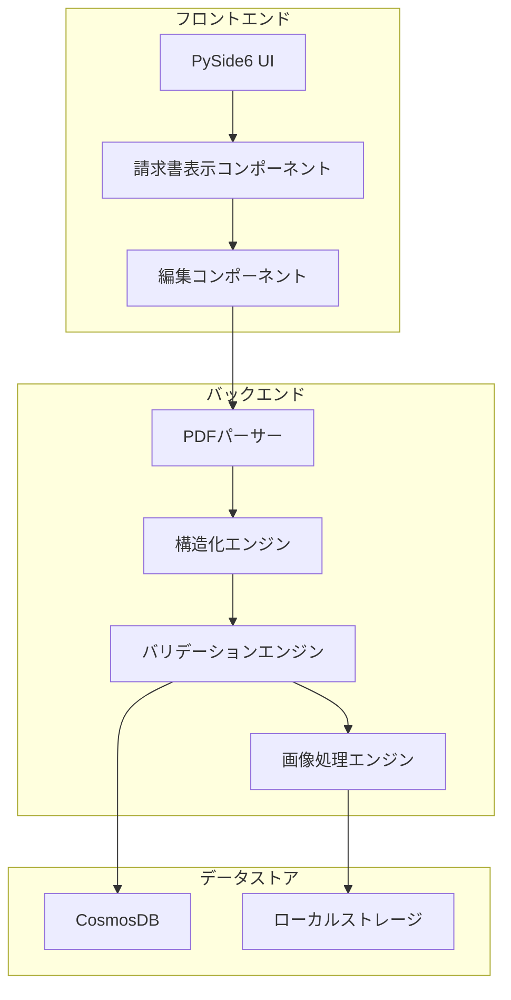
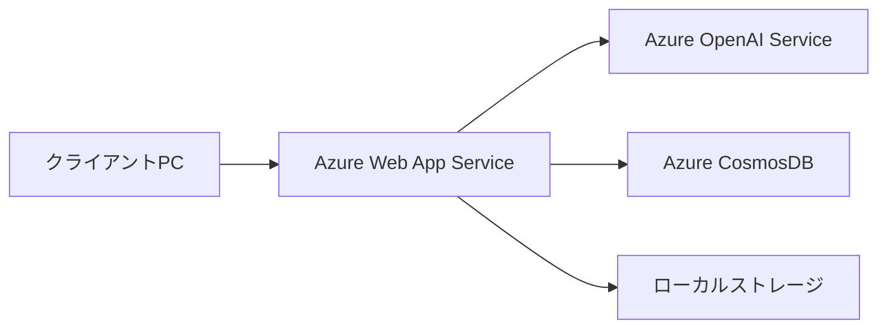
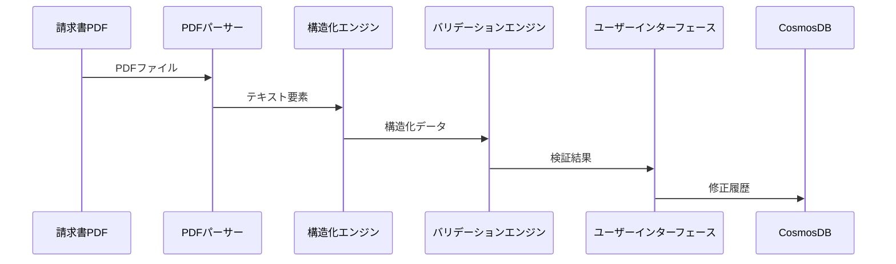
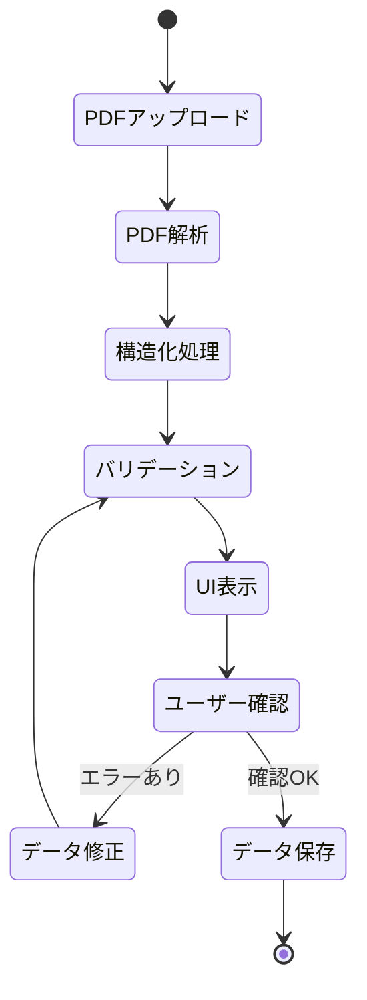
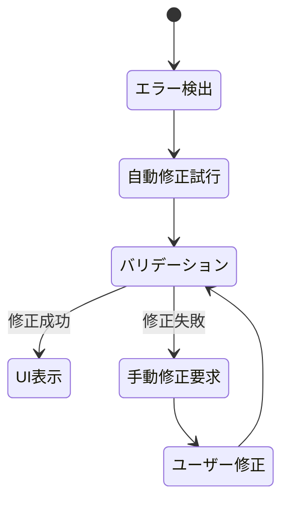

# 請求書構造化システム基本設計書

## 1. システム概要

### 1.1 システムの目的
請求書PDFファイルから必要な情報を自動抽出し、L-NET売上管理システムで利用可能な形式に変換するシステムを開発する。本システムは請求書担当者による確認・修正を前提とした補助システムとして機能し、最終的にL-NET売上管理システムへの入力作業を自動化することを目的とする。

### 1.2 主要機能の概要
1. PDF解析機能：請求書PDFからテキストと位置情報を抽出
2. 構造化機能：抽出したテキストをJSON形式に変換
3. バリデーション機能：抽出データの検証と正規化
4. 画像化機能：請求書明細部分の画像抽出
5. エクセル出力機能：構造化データの出力
6. UI機能：請求書処理の操作・管理画面
7. データベース連携：修正履歴のCosmosDB管理

### 1.3 システムの全体像


## 2. システムアーキテクチャ

### 2.1 全体アーキテクチャ


### 2.2 使用技術スタック
- **フロントエンド**
  - PySide6：デスクトップUIフレームワーク
  - Qt Quick：UIコンポーネント

- **バックエンド**
  - Python 3.10：基本実行環境
  - pdfminer.six：PDF解析
  - Azure OpenAI API：テキスト構造化
  - Pandas：データ操作
  - OpenPyXL：Excel操作
  - Pydantic：データバリデーション

- **データストア**
  - Azure CosmosDB：修正履歴管理
  - ローカルファイルシステム：一時データ保存

### 2.3 インフラストラクチャ構成


## 3. モジュール設計

### 3.1 データモデル
```python
class StockInfo(BaseModel):
    carryover: int
    incoming: int
    w_value: int
    outgoing: int
    remaining: int
    total: int
    unit_price: int

class QuantityInfo(BaseModel):
    quantity: int
    unit_price: Optional[int] = None

class EntryDetail(BaseModel):
    no: str
    description: str
    tax_rate: str
    amount: str
    stock_info: Optional[StockInfo] = None
    quantity_info: Optional[QuantityInfo] = None
    date_range: Optional[str] = None
    page_no: int

class CustomerEntry(BaseModel):
    customer_code: str
    customer_name: str
    department: str
    box_number: str
    entries: List[EntryDetail]

class DocumentStructure(BaseModel):
    pdf_filename: str
    total_amount: str
    customers: List[CustomerEntry]
```

### 3.2 PDFパーサーモジュール
```python
class PDFParser:
    def __init__(self, pdf_path: str):
        self.pdf_path = pdf_path
        self.pages = []

    def extract_text_with_positions(self) -> Dict[int, List[TextElement]]:
        """ページ毎のテキスト要素と位置情報を抽出"""
        # pdfminer.sixを使用してPDFからテキストと座標を抽出
        pass

    def validate_pdf_version(self) -> bool:
        """PDFバージョンの検証（1.4以上を推奨）"""
        pass

    def get_page_dimensions(self) -> List[Tuple[float, float]]:
        """各ページの寸法を取得"""
        pass
```

### 3.3 構造化エンジンモジュール
```python
class StructuringEngine:
    def __init__(self, openai_client: AzureOpenAI):
        self.client = openai_client
        self.prompt_engine = PromptEngineering()

    async def structure_invoice(self, text_elements: Dict[int, List[TextElement]]) -> DocumentStructure:
        """請求書テキストの構造化処理"""
        system_prompt = """
        請求書のテキストから顧客情報と明細を抽出し、構造化データとして出力してください。
        以下の重要な処理ルールに従ってください：

        1. 改ページ処理の考慮：
           - 各ページにはヘッダー情報が含まれる可能性がある
           - ページをまたぐ顧客情報は、同じ顧客コードで関連付け

        2. 顧客情報の継続性：
           - 顧客コードが出現した後、次の顧客コードまでの明細は同じ顧客に属する
           - 改ページ後も顧客情報の連続性を維持

        3. 明細の抽出ルール：
           - 明細番号の連続性を保持
           - 基本情報と追加情報を漏れなく抽出
           - 各明細にページ番号を付与
        """
        pass

    def validate_structure(self, invoice_data: DocumentStructure) -> ValidationResult:
        """構造化データの検証"""
        pass
```

### 3.4 バリデーションモジュール
```python
class ValidationEngine:
    def __init__(self, rules: List[ValidationRule]):
        self.rules = rules
        self.validators = self._initialize_validators()

    def validate_invoice(self, invoice_data: DocumentStructure) -> ValidationResult:
        """請求書データの検証実行"""
        validations = [
            self._validate_amounts,
            self._validate_dates,
            self._validate_required_fields,
            self._validate_relationships
        ]
        return self._run_validations(invoice_data, validations)

    def normalize_data(self, invoice_data: DocumentStructure) -> DocumentStructure:
        """データの正規化処理"""
        normalizers = [
            self._normalize_amounts,
            self._normalize_dates,
            self._normalize_tax_rates
        ]
        return self._apply_normalizers(invoice_data, normalizers)
```

### 3.5 画像処理モジュール
```python
class ImageProcessor:
    def __init__(self, dpi: int = 360):
        self.dpi = dpi
        self.image_params = self._load_image_params()

    def extract_detail_images(self, pdf_path: str, coordinates: List[Coordinate]) -> List[Image]:
        """明細部分の画像抽出"""
        pass

    def save_images(self, images: List[Image], output_dir: str) -> List[str]:
        """画像の保存処理（PDFファイル名－明細番号.jpg形式）"""
        pass
```

### 3.6 UIモジュール
```python
class MainWindow(QMainWindow):
    def __init__(self):
        super().__init__()
        self.init_ui()

    def init_ui(self):
        """UI初期化"""
        self.upload_widget = UploadWidget()
        self.monitor_widget = MonitorWidget()
        self.edit_widget = EditWidget()
        self.approval_widget = ApprovalWidget()
        self.setup_layout()

class UploadWidget(QWidget):
    def __init__(self, parent=None):
        """請求書PDFアップロードウィジェット"""
        super().__init__(parent)
        self.setup_drag_drop()
        self.setup_progress_bar()

class MonitorWidget(QWidget):
    def __init__(self, parent=None):
        """処理状況モニタリングウィジェット"""
        super().__init__(parent)
        self.setup_status_view()
        self.setup_error_display()

class EditWidget(QWidget):
    def __init__(self, parent=None):
        """請求書編集ウィジェット"""
        super().__init__(parent)
        self.setup_pdf_viewer()
        self.setup_data_editor()
        self.setup_validation_display()
```

### 3.7 データベースモジュール
```python
class CosmosDBManager:
    def __init__(self, connection_string: str):
        self.client = CosmosClient.from_connection_string(connection_string)
        self.database = self.client.get_database_client("invoices")
        self.container = self.database.get_container_client("modifications")

    async def save_modification_history(self, history: ModificationHistory) -> bool:
        """修正履歴の保存"""
        try:
            await self.container.create_item(body=history.dict())
            return True
        except Exception as e:
            logger.error(f"Failed to save modification history: {e}")
            return False

    async def get_modification_history(self, invoice_id: str) -> List[ModificationHistory]:
        """修正履歴の取得"""
        query = f"SELECT * FROM c WHERE c.invoice_id = '{invoice_id}' ORDER BY c.modified_at DESC"
        return [ModificationHistory(**item) for item in self.container.query_items(query)]
```

## 4. データフロー設計

### 4.1 データの流れ


### 4.2 データ構造定義
```typescript
interface ModificationHistory {
    invoice_id: string;
    modified_at: string;
    modified_fields: Array<{
        field: string;
        old_value: string;
        new_value: string;
        reason: string;
    }>;
    page_no: number;
    user_id: string;
}

interface ValidationResult {
    is_valid: boolean;
    errors: Array<{
        field: string;
        message: string;
        severity: 'error' | 'warning';
    }>;
    normalized_data?: DocumentStructure;
}
```

## 5. 処理フロー設計

### 5.1 メインフロー


### 5.2 エラーフロー


### 5.3 並列処理フロー
```python
class ParallelProcessor:
    def __init__(self, folder_path: str):
        self.folder_path = folder_path
        self.pdf_files = self._get_pdf_files()
        
    def _get_pdf_files(self) -> List[str]:
        """指定フォルダから全PDFファイルのパスを取得"""
        return glob.glob(f"{self.folder_path}/*.pdf")
    
    async def process_pdfs(self):
        """PDFファイルの並列処理を実行"""
        tasks = [self.process_single_pdf(pdf) for pdf in self.pdf_files]
        return await asyncio.gather(*tasks)

    async def process_single_pdf(self, pdf_path: str):
        """単一PDFの処理"""
        try:
            parser = PDFParser(pdf_path)
            text_elements = await parser.extract_text_with_positions()
            
            structurer = StructuringEngine(self.openai_client)
            invoice_data = await structurer.structure_invoice(text_elements)
            
            validator = ValidationEngine(self.validation_rules)
            validation_result = await validator.validate_invoice(invoice_data)
            
            return {
                'pdf_path': pdf_path,
                'invoice_data': invoice_data,
                'validation_result': validation_result
            }
        except Exception as e:
            logger.error(f"Error processing {pdf_path}: {e}")
            return {
                'pdf_path': pdf_path,
                'error': str(e)
            }
```

## 6. エラーハンドリング設計

### 6.1 エラーの種類と対応
| エラー種別 | 対応方法 | 重要度 |
|------------|----------|---------|
| PDFバージョン不適合 | ユーザーに通知し、推奨バージョンを案内 | 高 |
| 文字化け | 文字コード変換を試行、失敗時は手動確認 | 中 |
| 必須項目未検出 | UI上で該当項目を強調表示し、手動入力を要求 | 高 |
| 金額不整合 | 自動再計算を試行、差異を表示して確認を要求 | 高 |

### 6.2 ログ設計
```python
class LogManager:
    def __init__(self):
        self.logger = self._setup_logger()

    def log_error(self, error_type: str, details: Dict):
        """エラーログの記録"""
        self.logger.error(f"Error type: {error_type}", extra=details)

    def log_validation(self, result: ValidationResult):
        """検証結果のログ記録"""
        self.logger.info("Validation result", extra=result.dict())

    def log_modification(self, history: ModificationHistory):
        """修正履歴のログ記録"""
        self.logger.info("Modification history", extra=history.dict())
```

### 6.3 監視設計
- エラー発生率の監視
- 処理時間の計測
- リソース使用状況の監視
- ユーザー操作の追跡

## 7. セキュリティ設計

### 7.1 アクセス制御
- Azure AD認証によるユーザー認証
- CosmosDBへのアクセス制御
- 監査ログの記録

### 7.2 データ保護
- 請求書データの暗号化保存
- 一時ファイルの自動削除
- バックアップ戦略

### 7.3 通信セキュリティ
- Azure OpenAI APIとの通信暗号化
- CosmosDBとの通信暗号化
- ローカルファイルアクセスの制限

## 8. 非機能要件設計

### 8.1 パフォーマンス設計
- 目標処理時間：1請求書あたり30秒以内
- 並列処理による効率化
- メモリ使用量の最適化

### 8.2 スケーラビリティ設計
- 処理量に応じた並列度の調整
- リソース使用量の動的制御
- データベース接続プールの管理

### 8.3 可用性設計
- エラー時の自動リトライ
- 処理の中断・再開機能
- バックアップ・リストア手順

### 8.4 保守性設計
- モジュール化による機能分離
- 設定ファイルによる動作制御
- 詳細なログ記録

## 9. 開発スケジュール

### 9.1 フェーズ1（1次開発）
1. PDF解析機能の実装（2週間）
   - pdfminer.sixの導入と設定
   - テキスト抽出処理の実装
   - 座標情報の取得処理の実装

2. 構造化機能の実装（2週間）
   - Azure OpenAI APIの設定
   - プロンプトエンジニアリングの実装
   - Few-shot学習の実装

3. バリデーション機能の実装（2週間）
   - バリデーションルールの実装
   - 自動修正ロジックの実装
   - エラーハンドリングの実装

4. 画像処理機能の実装（1週間）
   - 画像抽出処理の実装
   - 画質調整機能の実装
   - 保存処理の実装

5. エクセル出力機能の実装（1週間）
   - データ変換処理の実装
   - Excel形式での出力処理
   - メタデータ付与の実装

6. UI基本機能の実装（2週間）
   - 各画面のレイアウト実装
   - イベントハンドリングの実装
   - エラー表示機能の実装

7. テスト・デバッグ（2週間）
   - 単体テストの実施
   - 結合テストの実施
   - パフォーマンステストの実施

### 9.2 フェーズ2（2次開発）
1. L-NET連携機能の設計（2週間）
2. RPA実装（3週間）
3. 統合テスト（2週間）

### 9.3 リスク管理
| リスク | 影響度 | 対策 |
|--------|--------|------|
| PDF解析精度の不足 | 高 | 事前検証の実施、代替手段の確保 |
| API利用コストの増大 | 中 | 使用量の監視、最適化の実施 |
| 処理速度の低下 | 中 | パフォーマンスチューニング、並列処理の活用 |
| データ整合性の崩れ | 高 | 厳密なバリデーション、バックアップの確保 |
