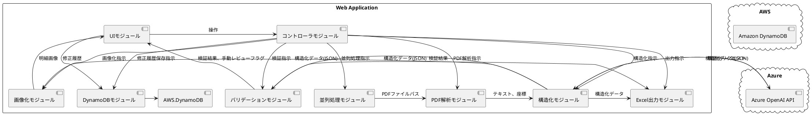
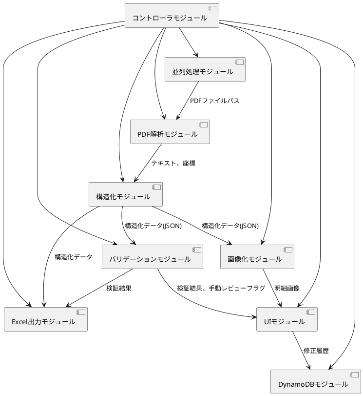

# 請求書構造化システム基本設計書

## 1. システム概要

本システムは、請求書PDFファイルから必要な情報を自動抽出し、構造化されたデータに変換することを目的とする。主な機能は以下の通り。

*   請求書PDFの解析
*   請求書情報の構造化
*   請求書内容のバリデーション
*   請求書明細の画像化
*   請求書データのエクセル出力
*   操作画面 (UI)
*   請求書修正履歴の管理
*   複数PDFの並列処理

## 2. システムアーキテクチャ

### 2.1. 全体アーキテクチャ図



### 2.2. コンポーネント構成

| コンポーネント名     | 説明                                                                                   | インターフェース                                                                                             |
| -------------------- | -------------------------------------------------------------------------------------- | ---------------------------------------------------------------------------------------------------------- |
| UIモジュール         | ユーザーインターフェースを提供する。PySide6を使用。                                         | ユーザーからの操作を受け付ける。コントローラモジュールに操作内容を通知する。                                                       |
| コントローラモジュール | 各モジュールを連携させ、全体の処理フローを制御する。                                             | UIモジュールからの操作を受け付ける。各モジュールに処理を指示する。                                                                 |
| PDF解析モジュール     | `pdfminer.six` を使用して請求書PDFからテキストと座標情報を抽出する。                            | コントローラモジュールからの指示を受け、PDFファイルを解析する。構造化モジュールにテキストと座標情報を渡す。                                   |
| 構造化モジュール     | Azure OpenAI API を使用して、抽出されたテキストをJSON形式に構造化する。Few-shot learning を活用。 | コントローラモジュールからの指示を受け、テキストを構造化する。バリデーションモジュール、画像化モジュール、Excel出力モジュールに構造化データを渡す。 |
| バリデーションモジュール | 構造化されたJSONデータに対して、定義されたルールに基づいて検証を行う。                               | コントローラモジュールからの指示を受け、構造化データを検証する。UIモジュール、Excel出力モジュールに検証結果を渡す。                                 |
| 画像化モジュール     | 請求書明細部分の画像を切り出す。                                                                 | コントローラモジュールからの指示を受け、画像を切り出す。UIモジュールに明細画像を渡す。                                                       |
| Excel出力モジュール    | 構造化データ、検証結果、修正履歴などをExcelファイルに出力する。                                     | コントローラモジュールからの指示を受け、Excelファイルを出力する。                                                                   |
| 並列処理モジュール   | 複数のPDFファイルを並列処理する。                                                               | コントローラモジュールからの指示を受け、並列処理を実行する。PDF解析モジュールにPDFファイルパスを渡す。                                       |
| DynamoDBモジュール   | 請求書修正履歴をDynamoDBに保存・管理する。                                                     | コントローラモジュールからの指示を受け、DynamoDBにデータを書き込む/読み込む。                                                           |

### 2.3. 使用技術スタック

*   プログラミング言語: Python 3.10
*   ライブラリ:
    *   pdfminer.six (PDF解析)
    *   pandas, pydantic (データ操作)
    *   azure-openai, langchain (AI処理)
    *   openpyxl (Excel操作)
    *   PySide6 (UI)
    *   boto3 (DynamoDB接続)
    *   asyncio, glob (並列処理)
*   API: Azure OpenAI API
*   データベース: Amazon DynamoDB

### 2.4. インフラストラクチャ構成
*   ホスティングプラットフォーム: Azure Web App Service
*   データベースサービス: Amazon DynamoDB

### 2.5. モジュール構成

システムは以下のモジュールから構成される。

*   **PDF解析モジュール**:
    *   `pdfminer.six` を使用して請求書PDFからテキストと座標情報を抽出する。
    *   複数ページのPDFに対応する。
*   **構造化モジュール**:
    *   Azure OpenAI API を使用して、抽出されたテキストをJSON形式に構造化する。
    *   Few-shot learning を活用し、プロンプトエンジニアリングを行う。
*   **バリデーションモジュール**:
    *   構造化されたJSONデータに対して、定義されたルールに基づいて検証を行う。
    *   金額、日付のフォーマットチェック、必須項目の存在検証、クロスチェック（合計金額の整合性など）を行う。
    *   ルール違反時には自動修正を試みる。修正できない場合は手動レビューフラグを設定する。
*   **画像化モジュール**:
    *   請求書明細部分の画像を切り出し、「PDFファイル名－明細番号.jpg」の形式で保存する。
    *   画質は設定ファイルで調整可能。
*   **Excel出力モジュール**:
    *   構造化データ、検証結果、修正履歴、処理タイムスタンプ、手動レビューフラグなどをExcelファイルに出力する。
*   **UIモジュール**:
    *   PySide6 を使用してユーザーインターフェースを構築する。
    *   請求書PDFアップロード、処理状況モニタリング、内容確認・修正、承認の各画面を提供する。
*   **DynamoDBモジュール**:
    *   請求書修正履歴をDynamoDBに保存・管理する。
*   **並列処理モジュール**:
    *   Pythonの `asyncio` と `glob` を使用して、複数のPDFファイルを並列処理する。
*   **コントローラモジュール**:
    *   各モジュールを連携させ、全体の処理フローを制御する。

### 2.2. モジュール間連携



## 3. データモデル

### 3.1. 構造化データ (JSON)

要件定義書に記載されているJSON形式に従う。

```json
{
  "invoice_number": "請求書番号",
  "issue_date": "発行日",
  "due_date": "支払期限",
  "vendor": {
    "name": "取引先会社名",
    "address": "取引先住所",
    "contact": "取引先連絡先"
  },
  "items": [
    {
      "name": "商品・サービス名",
      "quantity": "数量",
      "unit": "単位",
      "unit_price": "商品単価",
      "subtotal": "商品小計金額"
    }
  ],
  "subtotal": "請求書小計金額",
  "tax_rate": "適用税率",
  "tax_amount": "消費税金額",
  "total": "請求書合計金額"
}
```

### 3.2. DynamoDBテーブル設計

| 項目名             | データ型 | 説明                               |
| ------------------ | -------- | ---------------------------------- |
| invoice_id         | String   | 請求書ID (主キー)                   |
| item_name          | String   | 修正項目名                         |
| before_value       | String   | 修正前データ                       |
| after_value        | String   | 修正後データ                       |
| coordinate         | String   | 修正項目のPDF座標位置               |
| timestamp          | String   | 修正日時 (YYYY/MM/DD HH:mm:ss形式) |
| reason             | String   | 修正理由 (定型選択)                 |

## 4. UI設計

### 4.1. 画面構成

1.  **請求書PDFアップロード画面**:
    *   ドラッグ＆ドロップで請求書PDFをアップロード。
    *   アップロードされたPDFのフォーマットを検証。
    *   アップロード進捗状況を表示。
2.  **請求書処理状況モニタリング画面**:
    *   各請求書の処理状況 (解析中、構造化中、検証中、完了など) を表示。
    *   解析エラーが発生した場合、エラー内容を表示。
    *   処理状況はリアルタイムに更新。
3.  **請求書内容の確認・修正画面**:
    *   構造化された請求書データと、元のPDFを並べて表示。
    *   検証エラー箇所を強調表示。
    *   ユーザーが請求書情報を修正できる。
    *   修正後、再検証を実行。
4.  **請求書情報の承認画面**:
    *   最終確認として、請求書情報を表示。
    *   承認または差戻しを選択。
    *   承認された場合、L-NET連携処理へ移行 (2次開発)。

### 4.2. 画面遷移

```
アップロード画面 --> 処理状況モニタリング画面 --> 内容確認・修正画面 --> 承認画面
```

## 5. 外部API連携

*   **Azure OpenAI API**:
    *   JSON出力モードで利用する。
    *   APIキーなどの認証情報は、環境変数または設定ファイルで管理する。

## 6. エラーハンドリング

### 6.1. 想定されるエラー

*   **PDF解析エラー**:
    *   PDFファイルが破損している。
    *   PDFのバージョンが対応していない (1.4以上を推奨)。
    *   `pdfminer.six` がテキスト抽出に失敗する。
*   **構造化エラー**:
    *   Azure OpenAI API が請求書情報を正しく構造化できない。
    *   必須項目が抽出できない。
*   **バリデーションエラー**:
    *   金額のフォーマットが不正。
    *   日付のフォーマットが不正。
    *   必須項目が存在しない。
    *   合計金額が一致しない。
*   **画像化エラー**:
    *   明細部分の座標が特定できない。
    *   画像の切り出しに失敗する。
*   **Excel出力エラー**:
    *   Excelファイルの書き込みに失敗する。
*   **DynamoDBエラー**:
    *   DynamoDBへの接続に失敗する。
    *   データの書き込み/読み込みに失敗する。
*   **UIエラー**:
    *   PySide6 の予期せぬエラー。
*   **並列処理エラー**:
    *   プロセス間通信のエラー。
    *   リソース競合。

### 6.2. 例外処理

*   各モジュールで発生する可能性のあるエラーに対して、適切な例外処理を実装する。
*   エラーメッセージは、ユーザーにわかりやすく、かつ、デバッグに役立つ情報を含める。
*   エラーログをファイルまたはデータベースに出力する。

## 7. 並列処理

*   Pythonの `asyncio` と `glob` を使用して、複数のPDFファイルを並列処理する。
*   並列処理数は、CPUコア数やメモリ容量などを考慮して、設定ファイルで調整可能とする。
*   各プロセスのリソース使用状況を監視し、必要に応じて制限を設ける。

## 8. その他
* 請求書の検証ルールは、将来的な追加を考慮した設計とする。